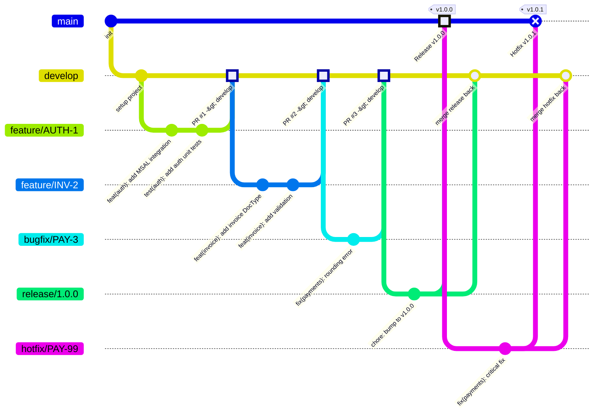

# Project Template — Python / Frappe Bench (v16) ERP

> A comprehensive, opinionated project template for Frappe Framework ERP projects.
> Inspired by [everything-claude-code](https://github.com/affaan-m/everything-claude-code).
> Delete folders you don't need — keep what fits your project.

---

## Quick Start

```bash
# 1. Install bench (if not installed)
pip install frappe-bench

# 2. Initialize bench
bench init my-bench --frappe-branch version-16
cd my-bench

# 3. Create a new site
bench new-site my-site.localhost --mariadb-root-password <password>

# 4. Create or clone your app
bench new-app my_app
# OR: bench get-app <repo-url>

# 5. Install the app on the site
bench --site my-site.localhost install-app my_app

# 6. Enable developer mode
bench --site my-site.localhost set-config developer_mode 1

# 7. Start bench
bench start

# 8. Run tests
bench --site my-site.localhost run-tests --app my_app
```

---

## Project Structure

```
/
|-- .claude/                # Claude Code configuration
|   |-- commands/           # Slash commands (/plan, /tdd, /code-review)
|   |-- rules/              # Always-active rules (coding style, security, git)
|
|-- .github/                # GitHub configuration
|   |-- copilot-instructions.md # GitHub Copilot project-specific context
|   |-- ISSUE_TEMPLATE/     # Issue templates (bug, feature, task)
|   |-- workflows/          # CI/CD pipelines (GitHub Actions)
|
|-- docs/                   # Documentation
|   |-- api/                # API specs, endpoint docs
|   |-- architecture/       # ADRs, system diagrams, data models
|   |-- guides/             # Developer onboarding, how-tos, setup guides
|
|-- infrastructure/         # Infrastructure as Code
|   |-- docker/             # Dockerfile, docker-compose.yml (frappe_docker)
|   |-- nginx/              # Nginx reverse proxy configuration
|   |-- sql/                # DB seed data, manual scripts (if needed)
|
|-- scripts/                # Automation scripts (bench helpers, setup, deploy)
|
|-- src/                    # Frappe app source (scaffolded by bench)
|   |-- README.md           # Setup instructions + app scaffolding reference
|   |-- my_app/             # Custom Frappe app (created by `bench new-app`)
|       |-- my_app/
|       |   |-- __init__.py
|       |   |-- hooks.py              # App hooks (scheduler, fixtures, overrides)
|       |   |-- patches.txt           # Migration patches list
|       |   |-- modules.json          # Module definitions
|       |   |-- api/                   # Custom whitelisted API endpoints
|       |   |-- utils/                 # Shared utility functions
|       |   |-- overrides/             # DocType controller overrides
|       |   |-- templates/             # Jinja2 templates, web views
|       |   |-- www/                   # Web pages (Frappe www)
|       |   |-- public/                # Static assets (JS, CSS, images)
|       |   |-- <module_name>/         # Frappe modules
|       |       |-- doctype/
|       |       |   |-- <doctype_name>/
|       |       |       |-- <doctype_name>.py        # Controller
|       |       |       |-- <doctype_name>.json       # Schema definition
|       |       |       |-- <doctype_name>.js         # Client script
|       |       |       |-- test_<doctype_name>.py    # Tests
|       |       |-- report/
|       |       |-- page/
|       |       |-- workspace/
|       |-- frontend/                  # React + TypeScript frontend
|       |   |-- src/
|       |   |-- package.json
|       |   |-- tsconfig.json
|       |   |-- vite.config.ts
|       |   |-- tailwind.config.js
|       |-- setup.py
|       |-- pyproject.toml
|
|-- frontend/               # Standalone React app (if not embedded in Frappe app)
|   |-- src/
|   |-- package.json
|   |-- tsconfig.json
|   |-- vite.config.ts
|   |-- tailwind.config.js
|
|-- tests/                  # Additional test suites
|   |-- unit/               # Unit tests (utils, services, business logic)
|   |-- integration/        # Integration tests (API endpoints, DocType workflows)
|   |-- e2e/                # End-to-end tests (Playwright/Cypress)
|
|-- .editorconfig           # Editor coding style settings
|-- .env.example            # Environment variable template
|-- .gitignore              # Git ignore rules
|-- CLAUDE.md               # Claude Code project configuration
|-- README.md               # This file
```

### Architecture Overview (Frappe MVC)

| Layer                    | Location                             | Purpose                                    |
|--------------------------|--------------------------------------|--------------------------------------------|
| DocType Controller       | `<module>/doctype/<name>/<name>.py`  | Business logic, lifecycle hooks            |
| DocType Schema           | `<module>/doctype/<name>/<name>.json`| Field definitions, permissions, naming     |
| Client Script            | `<module>/doctype/<name>/<name>.js`  | Frappe form UI logic                       |
| API Endpoints            | `api/`                               | Whitelisted functions, permission-checked  |
| Services / Utils         | `utils/`                             | Shared business logic, helpers             |
| Hooks                    | `hooks.py`                           | App events, scheduler, doc_events          |
| React Frontend           | `frontend/src/`                      | Custom React + TypeScript pages            |

> The `src/` folder ships empty — only a README with `bench new-app` setup commands.
> See [src/README.md](src/README.md) for full app scaffolding instructions.

---

## Git Flow

This project uses **Git Flow** with protected branches.

### Branch Model



### Protected Branches

| Branch    | Protection Rules                                                    |
|-----------|---------------------------------------------------------------------|
| `main`    | No direct pushes. Merge only via PR from `release/*` or `hotfix/*`  |
| `develop` | No direct pushes. Merge only via PR from `feature/*` or `bugfix/*`  |

### Branch Types

| Branch Pattern                         | Source     | Merges Into         | Purpose                          |
|----------------------------------------|------------|---------------------|----------------------------------|
| `feature/<ticket>-<description>`       | `develop`  | `develop`           | New features                     |
| `bugfix/<ticket>-<description>`        | `develop`  | `develop`           | Bug fixes (non-urgent)           |
| `release/<version>`                    | `develop`  | `main` + `develop`  | Release preparation              |
| `hotfix/<ticket>-<description>`        | `main`     | `main` + `develop`  | Urgent production fixes          |

### Workflow: New Feature

```bash
# 1. Start from develop
git checkout develop
git pull origin develop

# 2. Create feature branch
git checkout -b feature/INV-1-add-invoice-doctype

# 3. Work, commit (Conventional Commits)
git add .
git commit -m "feat(invoice): add Invoice DocType with validation"
git commit -m "test(invoice): add controller unit tests"
git commit -m "feat(invoice): add submit workflow"

# 4. Push and create PR -> develop
git push origin feature/INV-1-add-invoice-doctype
# Open PR on GitHub targeting develop

# 5. After review + CI passes -> Squash merge -> Delete branch
```

### Workflow: Release

```bash
# 1. Create release branch from develop
git checkout develop
git pull origin develop
git checkout -b release/1.0.0

# 2. Final fixes, version bump, changelog
git commit -m "chore: bump version to 1.0.0"

# 3. PR -> main (triggers production deployment)
# 4. Also merge back into develop
# 5. Tag the release
git tag -a v1.0.0 -m "Release 1.0.0"
git push origin v1.0.0
```

### Workflow: Hotfix

```bash
# 1. Branch from main (production)
git checkout main
git pull origin main
git checkout -b hotfix/PAY-99-fix-payment-rounding

# 2. Fix and commit
git commit -m "fix(payments): correct decimal rounding in total"

# 3. PR -> main AND PR -> develop
# 4. Tag with patch version
```

### Commit Message Format

```
<type>(<scope>): <description>

[optional body]

[optional footer]
```

| Type       | When to Use                                    |
|------------|------------------------------------------------|
| `feat`     | New feature                                    |
| `fix`      | Bug fix                                        |
| `refactor` | Code restructure (no behavior change)          |
| `docs`     | Documentation only                             |
| `test`     | Adding or correcting tests                     |
| `chore`    | Build process, CI, tooling                     |

### GitHub Branch Protection Setup

To protect `main` and `develop` from direct pushes:

1. Go to **Settings > Branches > Branch protection rules**
2. Add rule for `main`:
   - Require a pull request before merging
   - Require approvals (minimum 1)
   - Require status checks to pass (build, test, lint)
   - Require branches to be up to date before merging
   - Do not allow bypassing the above settings
   - Restrict who can push (no one directly)
3. Add the same rule for `develop`

---

## Claude Code Configuration

This template includes Claude Code configs inspired by [everything-claude-code](https://github.com/affaan-m/everything-claude-code).

### What's Included

| File / Folder                    | Purpose                                       |
|----------------------------------|-----------------------------------------------|
| `CLAUDE.md`                      | Project-level config — tells Claude about your stack |
| `.claude/rules/coding-style.md`  | Python/TS naming, file organization, code quality |
| `.claude/rules/git-workflow.md`  | Commit format, branch strategy, PR process    |
| `.claude/rules/testing.md`       | TDD workflow, pytest, Vitest, coverage        |
| `.claude/rules/security.md`      | Secrets, SQL injection, auth, Frappe security |
| `.claude/rules/patterns.md`      | Frappe architecture, DocType patterns, APIs   |
| `.claude/commands/plan.md`       | `/plan` — Implementation planning             |
| `.claude/commands/tdd.md`        | `/tdd` — Test-driven development              |
| `.claude/commands/code-review.md`| `/code-review` — Quality review               |

### Using Claude Code Commands

```bash
# Plan a new feature
/plan "Add Invoice DocType with submission workflow"

# Start TDD workflow
/tdd

# Review code quality
/code-review
```

### Customization

1. Edit `CLAUDE.md` with your project specifics
2. Add/modify rules in `.claude/rules/`
3. Add custom commands in `.claude/commands/`
4. See [everything-claude-code](https://github.com/affaan-m/everything-claude-code) for advanced configs (agents, hooks, skills)

---

## Tech Stack

| Component        | Technology                                     |
|------------------|------------------------------------------------|
| Language         | Python 3.11+ (backend), TypeScript (frontend)  |
| Framework        | Frappe Framework v16                           |
| ORM              | Frappe ORM (DocType-based)                     |
| Database         | MariaDB 10.6+                                  |
| Cache / Queue    | Redis (cache, queue, socketio)                 |
| Frontend         | React + TypeScript (custom pages)              |
| Frappe UI        | Standard views (forms, lists, reports)         |
| Icons            | Bootstrap Icons (`react-bootstrap-icons`)      |
| CSS              | Tailwind CSS (React pages)                     |
| Testing (Python) | pytest + Frappe test runner                    |
| Testing (TS)     | Vitest + Testing Library                       |
| E2E              | Playwright                                     |
| Linting (Python) | Ruff                                           |
| Linting (TS)     | ESLint + Prettier                              |
| Auth (dev)       | Frappe built-in                                |
| Auth (release)   | MSAL / OIDC (Microsoft Identity)               |
| Containerization | Docker (frappe_docker)                         |

---

## Deleting Unused Folders

This template is comprehensive by design. **Delete what you don't need:**

| If you don't need...       | Delete                                 |
|----------------------------|----------------------------------------|
| End-to-end tests           | `tests/e2e/`                           |
| Architecture docs          | `docs/architecture/`                   |
| Standalone React frontend  | `frontend/`                            |
| Automation scripts         | `scripts/`                             |
| Docker/infra configs       | `infrastructure/`                      |

---

## License

[Choose your license — MIT, Apache 2.0, proprietary, etc.]
