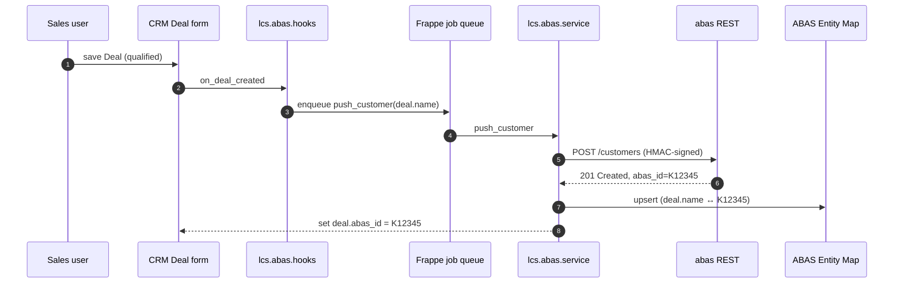
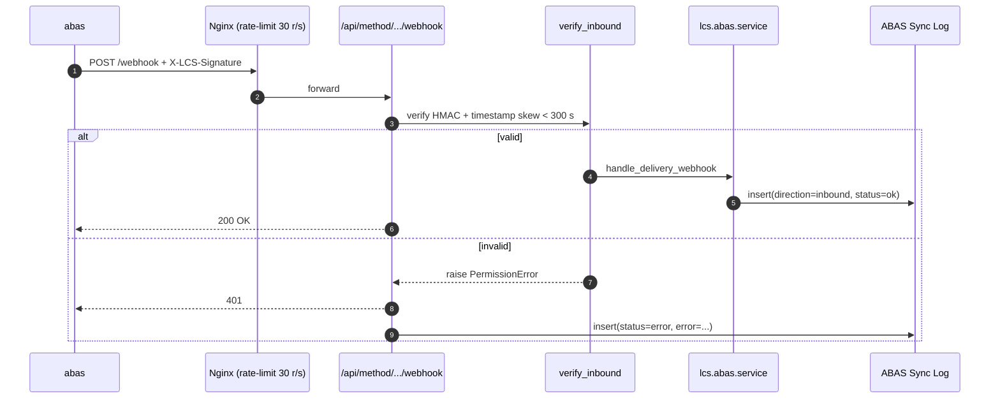
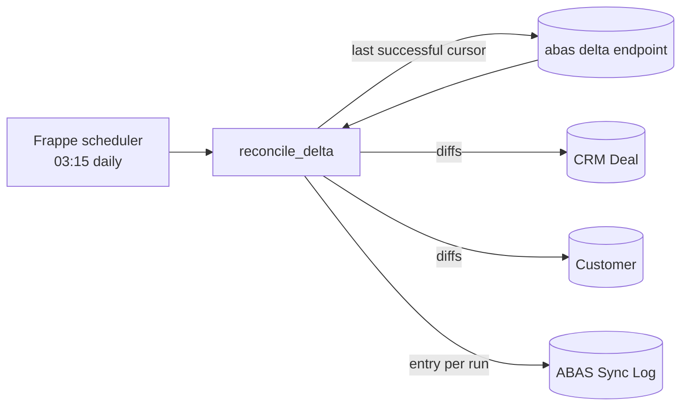

# abas ERP Integration

Bidirectional sync between CRM (`CRM Lead`, `CRM Deal`, `Contact`) and abas
(`Customer`, `Quotation`, `Order`). See
[`lcs_integrations/lcs_integrations/abas/`](../../lcs_integrations/lcs_integrations/abas/)
for the implementation.

## Outbound · CRM → abas

Key properties:

- **Idempotent** — `ABAS Entity Map` carries a unique constraint on `abas_id`; re-running `push_customer` is a no-op once the mapping exists.
- **Async** — the hook only enqueues a job. Save latency stays inside the UI budget even when abas is slow.
- **Signed** — `AbasClient` signs every request with HMAC-SHA256 (`X-LCS-Timestamp`, `X-LCS-Signature`). The shared secret rotates quarterly through Azure Key Vault.
- **Retried** — `tenacity` retries transient 5xx with exponential backoff, 3 attempts, capped at 30 s; after that the job fails and surfaces in `ABAS Sync Log`.

## Inbound · abas → CRM (delivery webhook)

## Nightly reconciliation

`reconcile_delta` reads the latest successful cursor from `ABAS Sync Log`,
asks abas for everything that changed since, and replays the diff into CRM.
The cursor is stored per entity type so one failing entity does not stall the
others.

## Data contracts

All payloads are typed via Pydantic DTOs in
[`schemas.py`](../../lcs_integrations/lcs_integrations/abas/schemas.py):
`AbasCustomer`, `AbasContact`, `AbasQuotationHeader`, `AbasOrderHeader`,
`DeliveryStatusEvent`. These are the single source of truth for the
integration — any abas schema drift must be handled here, never inline in
service code.

## Failure modes

| Mode                  | Detection                            | Mitigation                                                         |
| --------------------- | ------------------------------------ | ------------------------------------------------------------------ |
| abas returns 5xx      | `tenacity` retry exhaustion           | Job re-queued via Frappe's dead-letter queue, alert raised.        |
| HMAC mismatch inbound | `verify_inbound` raises               | Request rejected with 401, logged to `ABAS Sync Log` with payload. |
| Clock skew > 300 s    | Timestamp check in `verify_inbound`   | Same — prevents replay attacks.                                     |
| Duplicate abas_id     | `ABAS Entity Map` unique constraint   | `_upsert_entity_map` updates instead of inserting.                  |
