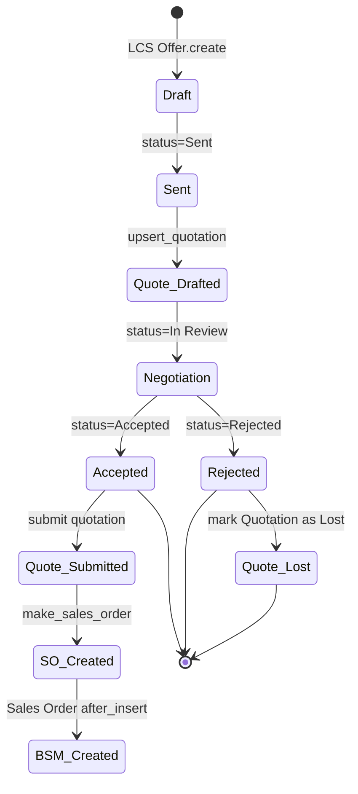

# ERPNext + Fusion Manage Integration

**Replaces:** historical `abas-integration.md` (retired — abas license dropped).

---

## Responsibilities

| System | Source of truth for |
|--------|---------------------|
| Frappe CRM + `LCS Project` | Lead capture, opportunity scoring, offer versioning, activity history |
| ERPNext | Customer master, formal Quotation, Sales Order, Delivery, Invoice |
| Autodesk Fusion Manage | Engineering items, BOM, change orders, item state |

---

## Automatic lifecycle — CRM → ERPNext



### Entry points

- **`erpnext_sync.customer_sync.on_organization_created` / `on_organization_updated`** — fires on CRM Organization, upserts ERPNext Customer by name. One-way (CRM → ERP) so there is no loop back risk.
- **`erpnext_sync.quotation_sync.on_offer_updated`** — fires on LCS Offer status transitions. Branches on the new status:
  - `Sent` → `upsert_quotation()` — creates or updates Quotation, writes back `LCS Offer.erpnext_quotation` AND `Quotation.lcs_offer`.
  - `Accepted` → submits Quotation (docstatus=1), calls ERPNext's `make_sales_order()`, writes the `lcs_project` back-link on the SO **before** insert so the Sales Order `after_insert` can spawn a BSM Project.
  - `Rejected` → sets Quotation.status='Lost' + won_lost_reason.

### Back-link integrity

| Forward | Reverse | Enforcement |
|---------|---------|-------------|
| `LCS Offer.erpnext_quotation` | `Quotation.lcs_offer` | Both set in one transaction during `upsert_quotation()`. |
| `LCS Offer.erpnext_sales_order` | `Sales Order.lcs_project` | SO field populated pre-insert; `LCS Offer.on_trash` clears the back-link if the offer is deleted. |
| `LCS Project.bsm_project` | `BSM Project.sales_order` + `BSM Project.lcs_project` | Set atomically in `bsm_sync.on_sales_order_created`. |

Enforcement asserted by `tests/test_integration_e2e.py` — the E2E suite
includes per-offer quotation + per-SO BSM duplicate checks.

---

## Fusion Manage — read-mostly for Phase 1

Single DocType `LCS Fusion Manage Settings` stores tenant + OAuth2 token.
Hourly scheduler `fusion_manage.service.sync_linked_projects` iterates
every `LCS Project` with a `fusion_item_id` set and refreshes:

- `fusion_item_number`
- `fusion_item_description`
- `fusion_item_state` (PLM workflow state — e.g. "Released", "In Review")
- `fusion_last_sync`

### Why read-only for now

- Engineering data is authoritative in Fusion; pushing arbitrary changes
  from CRM risks BOM integrity.
- When a user needs to act on item data they deep-link via
  `FusionManageDeepLink.vue` which opens the item in the Fusion Manage
  web UI in a new tab.

### Future work

- Write BOM → ERPNext Items conversion on "Released" state transition
- Engineering Change Order (ECO) notifications back to CRM activity feed

---

## Field matrix — custom fields installed by `install_custom_fields.py`

| DocType | Field | Type | Purpose |
|---------|-------|------|---------|
| CRM Organization | `erpnext_customer` | Link | Back-link, set by customer_sync |
| CRM Deal | `erpnext_customer` | Link | Mirrored from linked org |
| CRM Lead | `erpnext_customer` | Link | For converted leads |
| Sales Order | `lcs_project` | Link | Enables BSM auto-creation |
| Quotation | `lcs_offer` | Link | Enables duplicate detection |
| BSM Project | `lcs_project` | Link | Back from site to commercial |
| BSM Project | `sales_order` | Link | Back to commercial document |
| Lead | `lcs_score` | Int | Read-only, populated by lead_scoring module |

Patch `remove_abas_legacy.py` drops all legacy `abas_*` fields
idempotently from existing sites.

---

## Testing

```bash
# End-to-end — exercises the full pipeline, asserts no duplicates
bench --site lcs.local execute lcs_integrations.tests.test_integration_e2e.run_all

# Read-only production audit
bench --site lcs.local execute lcs_integrations.tests.check_production_duplicates.run
```

Current state: 13/13 functional + 8/8 duplicate checks green.
