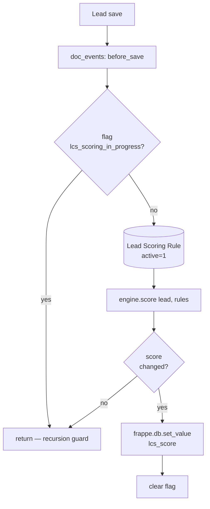

# Lead Scoring

Rule-driven score recomputed whenever a `CRM Lead` is created or updated.
Implementation:
[`lcs_integrations/lcs_integrations/lead_scoring/`](../../lcs_integrations/lcs_integrations/lead_scoring/).

## Flow

The engine (`engine.py`) is **framework-agnostic**: `score(lead_dict,
rules_iterable)` takes plain dicts, so unit tests run without a Frappe site.
This keeps the scoring logic inside the 80 % coverage gate.

## Supported operators

| Operator  | Semantics                                             |
| --------- | ----------------------------------------------------- |
| `eq`      | `str(field) == target`                                |
| `neq`     | `str(field) != target`                                |
| `in`      | `str(field) in comma_split(target)`                   |
| `not_in`  | `str(field) not in comma_split(target)`               |
| `contains`| `target.lower() in str(field).lower()` — null-safe   |
| `gt`      | `float(field) > float(target)` — returns False on TypeError/ValueError |
| `lt`      | `float(field) < float(target)` — returns False on TypeError/ValueError |

Rules are evaluated in descending `priority`, but the result is a simple sum
of `score_delta` values — priority only affects tie-breaking when the UI
displays the matched rules.

## Why the recursion guard

`frappe.db.set_value("CRM Lead", ..., "lcs_score", ...)` can re-fire
`before_save` depending on site-level doc_events wiring. The module-level
`_FLAG = "lcs_scoring_in_progress"` prevents infinite recursion without
forcing callers to disable hooks.

## Editing rules

Rules live in the `Lead Scoring Rule` DocType and are configurable from the
Frappe desk — no code deploy needed. For seeded defaults see the patch:
[`patches/v1_0/install_custom_fields.py`](../../lcs_integrations/lcs_integrations/patches/v1_0/install_custom_fields.py).
