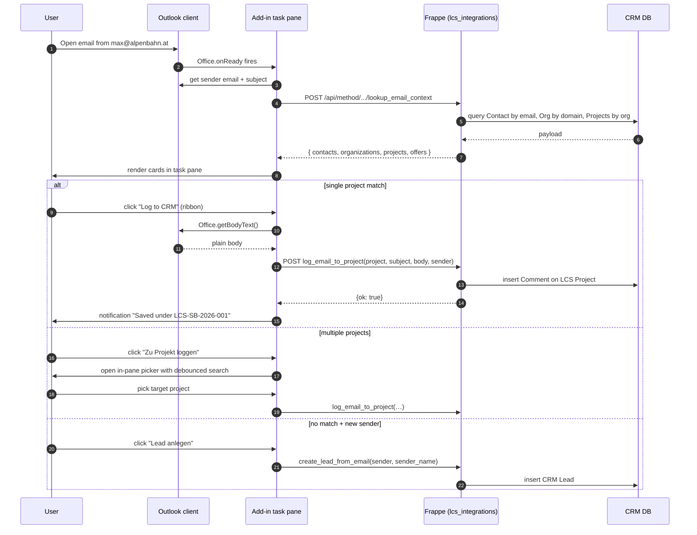

# Outlook Add-in

A Microsoft 365 Mail Add-in that surfaces CRM context inside Outlook —
Desktop, Web, and Mobile. Complements (doesn't replace) the existing
background `outlook_sync` module which pulls mail/calendar into Frappe.

---

## Responsibilities split

| Concern | Home |
|---------|------|
| Background delta sync (every 5 min) pulling mail headers + calendar events into Frappe | `lcs_integrations/outlook_sync/` — scheduled job, Graph API webhook |
| In-client task pane showing project context + one-click "log this email" | `lcs_integrations/outlook_addin/` — manifest + task pane + APIs |

The add-in is the *interactive* layer the user sees; the sync module
is the *bulk* layer that keeps the CRM complete.

---

## Interaction flow



---

## Components

### Manifest (`www/outlook-addin/manifest.xml`)

Standard Office Add-in manifest v1.1 with `MailApp` host type.
Declares:

- Two ribbon buttons on the `MessageReadCommandSurface`:
  - **LCS CRM öffnen** — shows task pane
  - **Zu Projekt loggen** — executes `quickLogToCRM` without opening pane
- Requires `Mailbox` capability 1.5 (all modern Outlook clients)
- `ReadWriteMailbox` permission (body access for logging)
- App domain restricted to `https://lcs.local` — the manifest won't
  load pages from anywhere else

### Task pane (`taskpane.html/js/css`)

Single-page, no framework, Office.js CDN only.

States:

- **loading** — initial fetch
- **matched** — render projects/offers/orgs/contacts cards
- **no-match** — offer "Lead anlegen" action
- **error** — retry button

Key UI behaviors:

- Cards are keyboard-focusable with Enter to open the Frappe record in a
  modal dialog via `Office.context.ui.displayDialogAsync`.
- Picker modal has debounced search (250ms) calling `search_projects`.
- Toast notifications for success/failure so users don't have to watch
  for silent side effects.

### Commands handler (`commands.html/js`)

Hidden page — pure function host for ribbon actions. The
`quickLogToCRM` function:

1. Reads sender + subject from `Office.context.mailbox.item`
2. Calls `lookup_email_context` to find matching projects
3. If exactly one match, reads body, calls `log_email_to_project`
4. If zero or multiple matches, shows a notification telling the user
   to open the task pane for manual selection (can't open pane from
   a command without explicit user gesture)

---

## Backend (`outlook_addin/api.py`)

All endpoints `@frappe.whitelist()`. They share a **read-mostly**
philosophy — the only mutations are explicit create intents (log email,
create lead).

| Endpoint | Request | Response |
|----------|---------|----------|
| `lookup_email_context` | `sender_email`, `subject` | `{matched, contacts, organizations, projects, offers}` |
| `log_email_to_project` | `project`, `subject`, `body`, `sender` | `{ok, comment, project}` |
| `create_lead_from_email` | `sender`, `sender_name?`, `subject?` | `{ok, lead, created}` (idempotent — returns existing if sender already a Lead) |
| `search_projects` | `query`, `limit` | array of projects by name/number match |

### Matching logic (`lookup_email_context`)

- **Contacts** — exact email match on `tabContact Email.email_id` (case-insensitive)
- **Organizations** — domain extracted from sender, matched against `tabCRM Organization.website` (substring)
- **Projects** — active projects (`status NOT IN (Completed, Cancelled)`) linked to any matched org
- **Offers** — in-flight offers (`status IN (Draft, Sent, In Review)`) for any matched project

A `matched` boolean tells the UI whether to render the normal layout
or the "no match" state.

---

## Authentication

The add-in piggy-backs on the user's existing CRM browser session —
no separate MSAL flow inside Outlook. The fetch calls include
`credentials: "include"` so the same-origin cookie is sent.

This works because:

1. The manifest pins `AppDomains` to `https://lcs.local`
2. The user has signed into the CRM in the main browser at least once
3. Modern Outlook runs the add-in inside an embedded WebView that
   shares cookies with the default browser

If the cookie expires mid-session, API calls return 403 and the user
is prompted to re-auth — handled by the error state.

---

## Deployment

### Individual install (dev / power user)

1. User downloads `https://lcs.local/outlook-addin/manifest.xml`
2. Outlook → *Add-Ins verwalten* → *Eigenes Add-In hinzufügen* → *Aus Datei*

### Central rollout (production)

Microsoft 365 Admin Center → *Integrated Apps* → *Upload custom app* →
*Office add-in* → paste manifest URL:

```
https://lcs.local/outlook-addin/manifest.xml
```

Assign to users / groups. Up to 12h propagation to all Outlook clients.

---

## Why not Modern Office JavaScript Copilot / Power Platform?

- Copilot requires M365 Copilot licensing — not everyone at LCS has one.
- Power Platform connectors need a Dataverse subscription and run
  outside our infrastructure.
- Office Add-in with plain JS + Frappe API stays within our existing
  M365 business plan and deploys from our own server.

---

## Future work

- **Compose mode** — also show context when writing *to* a customer
  (currently read-only)
- **Calendar hooks** — show meeting attendees' CRM context in calendar
  events
- **Mobile-optimised pane** — current CSS works on phone but the project
  picker modal is cramped
- **Offline** — inherit the IndexedDB queue from the SPA so the add-in
  works on trains / in the Alps without WiFi
