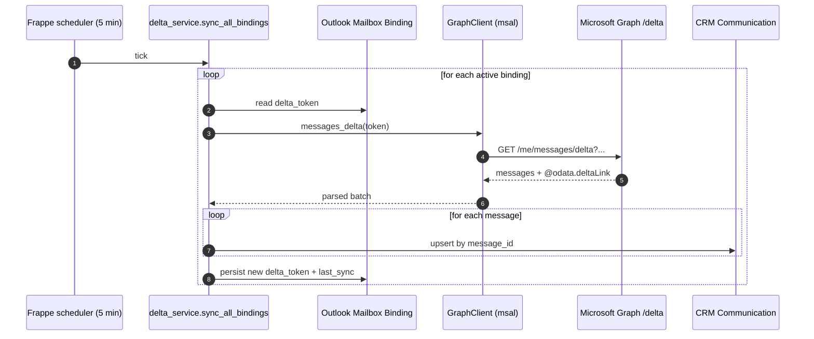
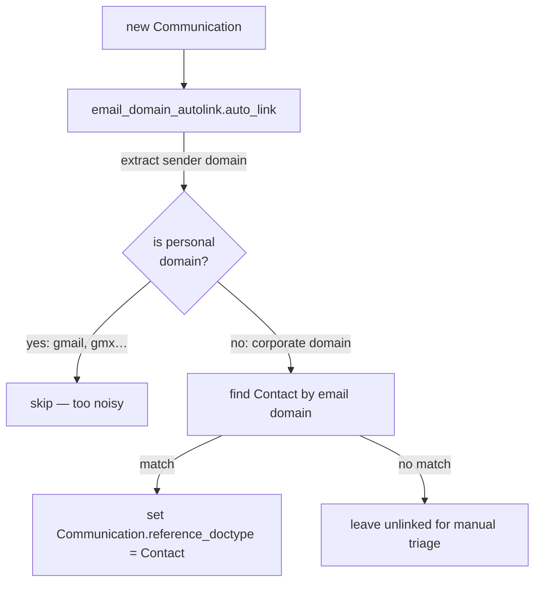

# Outlook Mail Sync

Pulls each user's mailbox into CRM `Communication` records so any team member
sees the full customer conversation regardless of who sent / received the
mail. Implementation:
[`lcs_integrations/lcs_integrations/outlook_sync/`](../../lcs_integrations/lcs_integrations/outlook_sync/).

## Delta-sync loop



Why Graph's `/delta` endpoint and not IMAP / EWS:

- First-party, OAuth-only → no app-password, no MFA-blocking secrets.
- Returns only what changed since the previous cursor → O(Δ) per cycle.
- Works uniformly for Exchange Online and hybrid setups.

## Auth

```mermaid
flowchart LR
    subgraph app[lcs_integrations]
        mc[msal.ConfidentialClientApplication]
        gc[GraphClient]
    end
    subgraph entra[Entra tenant]
        app2[App registration<br/>Mail.Read delegated / application]
        kv[(Azure Key Vault)]
    end

    kv -->|client_secret| mc
    mc -->|acquire_token_for_client| entra
    entra -->|bearer| gc
    gc --> graph[(Microsoft Graph)]
```

The connector uses application permissions (`Mail.Read`, `Mail.ReadBasic.All`)
where granted by the tenant admin; otherwise it falls back to per-user
delegated tokens stored encrypted in `Outlook Mailbox Binding`.

## Dedup strategy

Each `Communication` carries the Graph `message_id`. The upsert keys on that
id so re-running the sync never creates duplicates — critical because Graph
can re-emit a message if the delta-token expires (default 30 days).

## Auto-linking to Contacts



Personal domains (gmail, gmx, outlook, hotmail, yahoo, …) are skipped to
avoid wiring unrelated private addresses to a random matching contact. The
list lives in `email_domain_autolink/hooks.py::_PERSONAL_DOMAINS`.

## Failure modes

| Mode                          | Detection                        | Mitigation                                                        |
| ----------------------------- | -------------------------------- | ----------------------------------------------------------------- |
| delta_token expired           | Graph returns `410 Gone`         | Reset token, run full sync; logged as `last_error`.               |
| Token acquisition fails       | msal raises                      | Binding flagged disabled; admin notified via Frappe `Error Log`. |
| Partial batch fails mid-loop  | per-message try/except           | Remaining messages still ingested; failing ones retried next tick. |
| Rate-limit (429)              | Graph response header             | Honour `Retry-After`, back off; cycle resumes next scheduler tick. |
