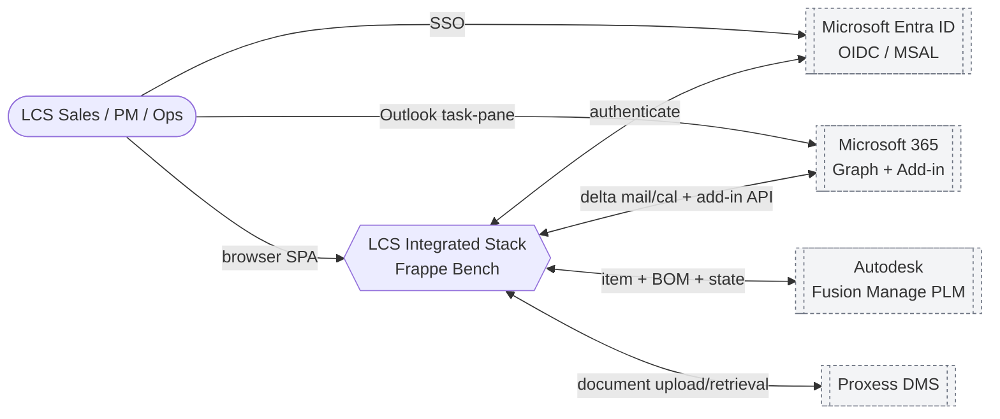
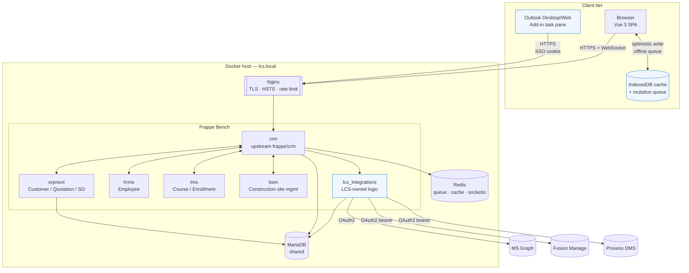
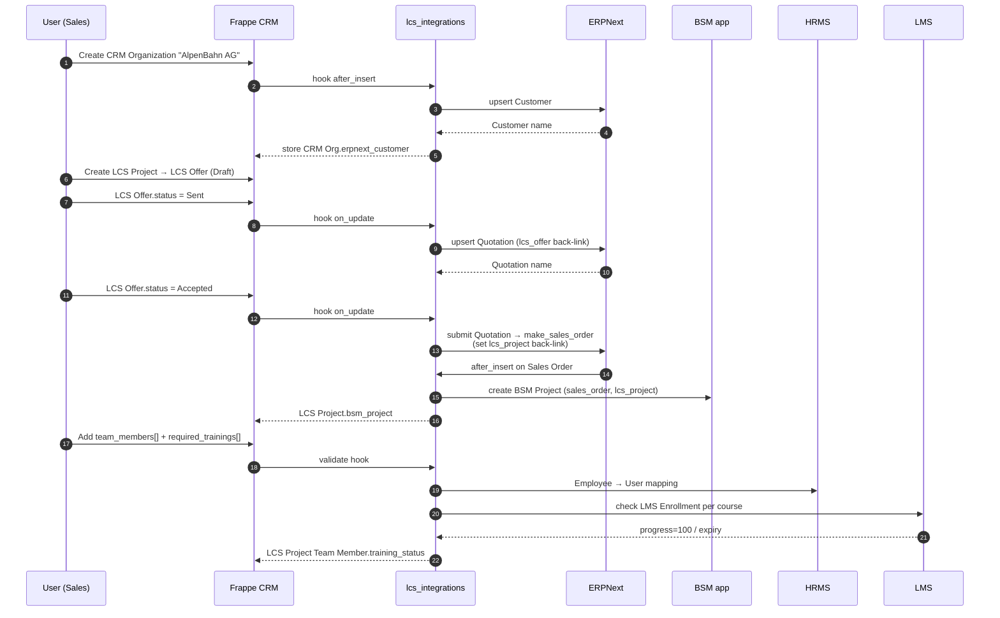
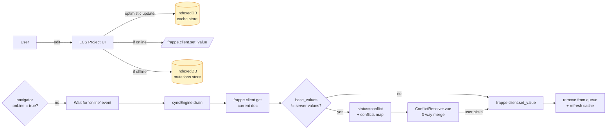
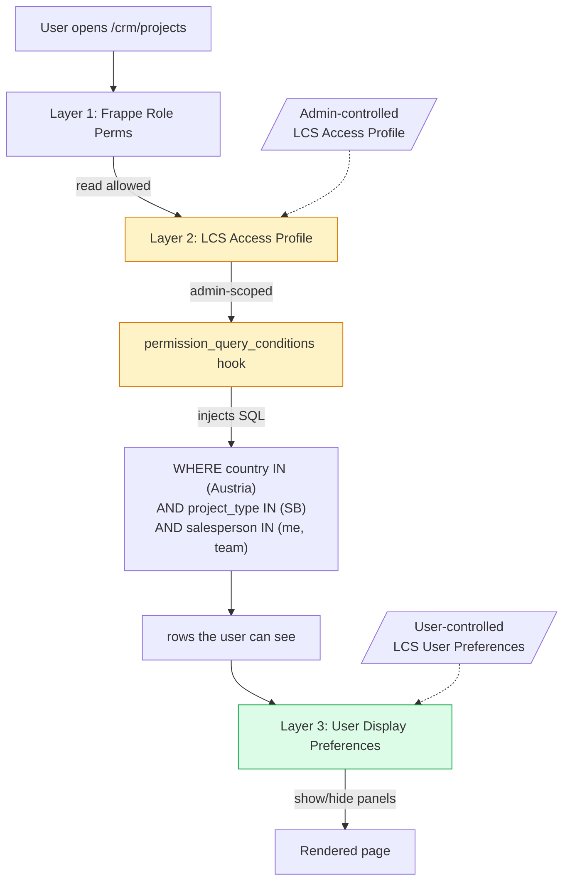

# LCS CRM — Architecture Overview

Scope: adaptation of the upstream `frappe/crm` fork into the LCS Cable Cranes
integrated business stack. For the "why" behind technology choices see
[ADR 0001](../adr/0001-frappe-over-greenfield.md) ·
[ADR 0002](../adr/0002-postgres-over-mariadb.md) ·
[ADR 0003](../adr/0003-msal-oidc.md) ·
[ADR 0004](../adr/0004-erpnext-over-frappe-crm.md).

> **abas ERP is retired.** Production ERP is ERPNext installed alongside
> frappe/crm on the same bench; PLM is Autodesk Fusion Manage. Anything
> in historical docs or code comments referring to `abas_*` fields is
> stale.

---

## C4 · Context — the six-system landscape

`LCS Project` is the pivot entity. Every downstream system keeps its own
authoritative record and exposes it back to the CRM via typed links.

---

## C4 · Container — what runs where

---

## Data flow — CRM → ERP → Site (cross-module automation)

---

## Offline edit sync — client-side durable queue

---

## Visibility — three-layer access model

---

## Module boundaries

| Concern | Home | Rationale |
|---------|------|-----------|
| Core CRM UI & DocTypes | `repo/crm` (upstream) | Stays cherry-pick-compatible with Frappe's develop branch |
| LCS business entities (Project, Offer, Matrix, Team Member, Required Training, Offer Template, Access Profile, User Preferences) | `repo/lcs_integrations/lcs_integrations/lcs_integrations/doctype/` | Separate app → upstream merges never collide |
| ERPNext sync (Customer, Quotation, Sales Order) | `lcs_integrations/erpnext_sync/` | Hook-driven, one module per target doctype |
| Fusion Manage (PLM) | `lcs_integrations/fusion_manage/` | REST v3 client + hourly pull service |
| Cross-module orchestration (Sales Order → BSM Project, LMS training check, integration status) | `lcs_integrations/cross_module/` | Multi-app fan-out lives here, not in individual connectors |
| Visibility + access profiles | `lcs_integrations/visibility/` | `permission_query_conditions` + `has_permission` hooks + whitelisted get/set APIs |
| Outlook Add-in | `lcs_integrations/outlook_addin/` (API) + `www/outlook-addin/` (static) | Office.js manifest + task pane + commands; same-origin SSO |
| Offline sync | `frontend/src/utils/{offlineDB,syncEngine}.js` + `composables/useOfflineList.js` | Vanilla IndexedDB, FIFO mutation queue, field-level conflict detection |

---

## Cross-cutting concerns

- **Observability** — all connectors log through `frappe.log_error()` with namespaced category (`erpnext_sync.quotation`, `fusion_manage.sync`, `bsm_sync`). Dashboard at `/app/error-log?category_like=%sync%`.
- **Security** — every inbound webhook HMAC-signed or OAuth2 bearer; outbound secrets in Azure Key Vault; HTTPS + HSTS enforced on nginx.
- **Feature gating** — hooks.py auto-detects whether a target app is installed (`frappe.db.exists("DocType", "BSM Project")`); missing apps skip silently instead of raising.
- **Caching** — access profiles cached in Redis per-user, invalidated on profile or preferences save.
- **Auditability** — `LCS Offer` on_trash cleans forward links; `test_integration_e2e.py` + `check_production_duplicates.py` assert no orphans or duplicate one-to-one mappings.

---

## See also

- [Offline sync architecture](offline-sync.md)
- [Outlook Add-in](outlook-addin.md)
- [ERPNext + Fusion integrations](erpnext-fusion.md)
- [Visibility & access control](visibility-access.md)
- [Outlook delta sync](outlook-sync.md) (background email/calendar sync — separate from the add-in)
- [Proxess DMS](proxess-dms.md)
- [Lead scoring](lead-scoring.md)
