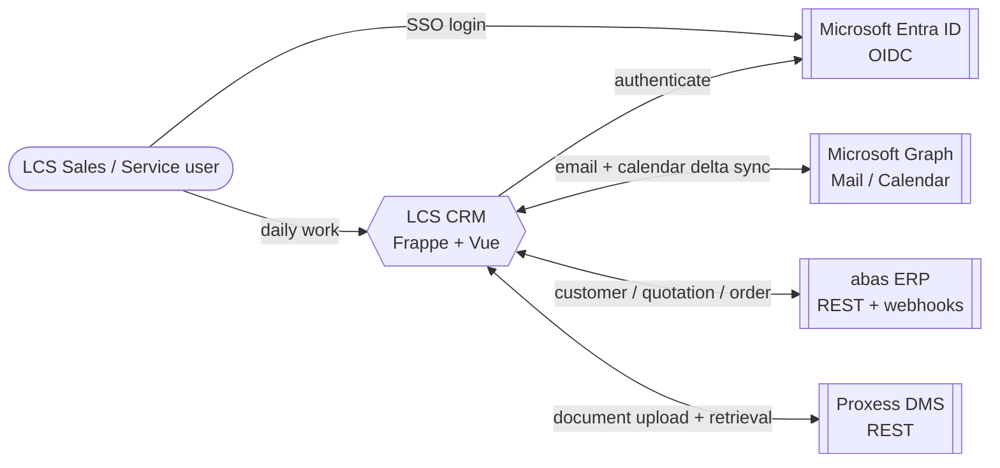
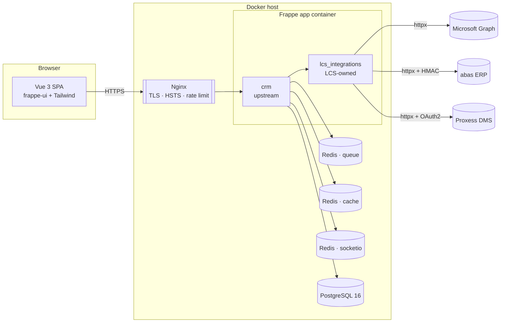

# LCS CRM — Architecture Overview

Scope: adaptation of the upstream `frappe/crm` fork to LCS requirements.
For the "why" behind key technology choices see
[ADR 0001](../adr/0001-frappe-over-greenfield.md) ·
[ADR 0002](../adr/0002-postgres-over-mariadb.md) ·
[ADR 0003](../adr/0003-msal-oidc.md).

## C4 · Context

## C4 · Container

## Module boundaries

| Concern                         | Home                                          | Rationale                                                                   |
| ------------------------------- | --------------------------------------------- | --------------------------------------------------------------------------- |
| Core CRM UI & DocTypes          | `repo/crm` (upstream)                         | Stay cherry-pick-compatible with Frappe's `develop` branch.                 |
| LCS-specific DocTypes & hooks   | `repo/lcs_integrations`                       | Separate Frappe app → upstream merges never collide with LCS business rules. |
| External connectors             | `lcs_integrations/{abas,outlook_sync,proxess}` | One package per external system; each has its own client, service, schemas. |
| Authentication                  | Frappe Social Login Key (Entra) + MSAL token  | Single sign-on via Entra, no local password storage.                        |
| Infra                           | `docker/` + `scripts/bootstrap_wsl.sh`        | WSL2 dev, Docker/Compose for CI + prod.                                     |

## Cross-cutting concerns

- **Observability** — all connectors log through the Frappe log; `ABAS Sync Log`, `Outlook Mailbox Binding.last_error` and a dedicated `Error Log` category give operators a single place to triage.
- **Security** — every inbound webhook is HMAC-signed (abas) or OAuth2-bearer (Proxess); outbound calls rotate credentials via Azure Key Vault in production.
- **Feature gating** — `lcs_integrations/hooks.py` fixtures ship with the app; operators can disable a connector by setting `lcs.<system>.enabled = 0` in the site config.
