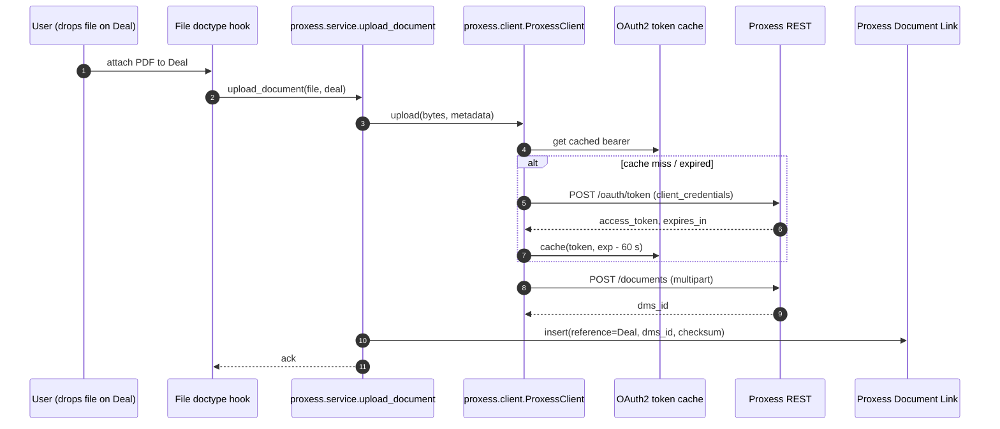

# Proxess DMS Integration

Uploads attachments to Proxess and links them back to CRM records via
`Proxess Document Link`. See
[`lcs_integrations/lcs_integrations/proxess/`](../../lcs_integrations/lcs_integrations/proxess/).

## Upload flow

## Read flow (list documents on a Deal)

Reads are served from `Proxess Document Link` alone — we do not re-query
Proxess on every page load. A nightly job (planned) will reconcile the link
table with Proxess to catch out-of-band deletions.

## Security

- **OAuth2 client_credentials** — no user-level credentials leave CRM.
- **Token cache** — short-lived access tokens stored in Redis with a 60 s
  safety margin before expiry; never written to disk.
- **Checksum** — SHA-256 of the uploaded payload stored in the link row so
  tampering between CRM and Proxess is detectable.

## Failure modes

| Mode                | Detection                       | Mitigation                                                      |
| ------------------- | ------------------------------- | --------------------------------------------------------------- |
| Proxess 5xx         | `tenacity` retry on upload      | Re-queued via Frappe; user sees "upload pending" badge.         |
| Token revoked       | 401 on upload                   | Invalidate cache, retry once with a fresh token.                 |
| Payload > max size  | 413 Payload Too Large           | Fail fast, surface human-readable error to the UI.               |
| Link row orphaned   | Nightly reconcile job           | Delete `Proxess Document Link` rows whose dms_id 404s.           |
