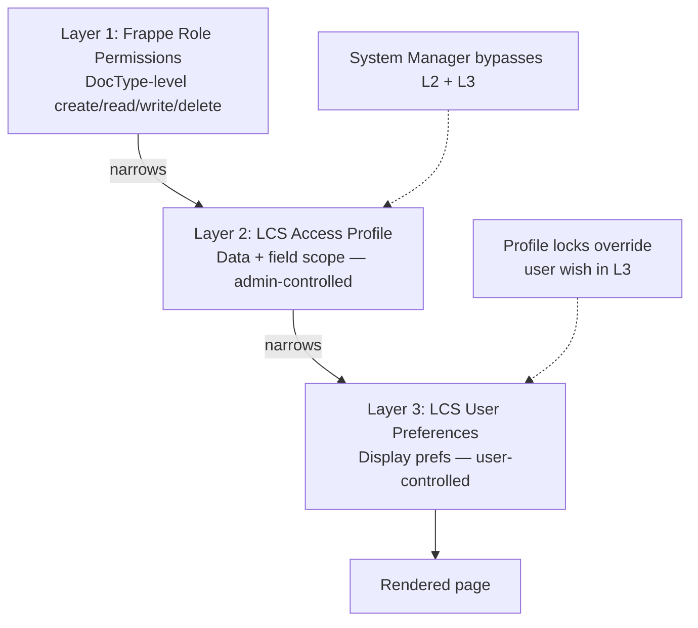

# Visibility & Access Control

Three layers stack on top of Frappe's built-in role system to give each
user a tailored view of the CRM — restricted by admin policy where
needed, personalised by the user everywhere else.

---

## The three layers



Each layer can only **restrict** further — never widen access. A user
without the `Sales User` role can't be granted data access via a
profile, and a user whose profile hides pricing can't re-enable those
fields via preferences.

---

## Layer 2 — Access Profile (admin)

DocType `LCS Access Profile`. One named profile per logical team / level.

### Data scope

- `scope_countries` — list of allowed Country values (empty = all)
- `scope_project_types` — list of allowed SB/WI/LL/SK (empty = all)
- `scope_own_only` — if checked, only projects where `salesperson = me`
- `scope_team_members` — extends own_only to include other users'
  projects (e.g. a sales manager seeing their team's pipeline)

### Field-level hide

Toggles that remove entire UI sections:

- `hide_pricing` — Budget, Richtpreis, Angebot cards + sidebar block
- `hide_team` — HRMS team section + required trainings
- `hide_fusion` — Fusion Manage fields + deep link
- `hide_bsm` — BSM construction section
- `hide_forecasting` — Forecasting page (replaced by a lock-screen if
  navigated to directly)
- `hide_opportunity_matrix` — Opportunity Matrix tab

### Action permissions

- `can_export`, `can_create_projects`, `can_delete_projects`
- `can_accept_offers` — controls status→Accepted transitions
- `can_edit_phase` — edit the project's pipeline phase at all

### Example profiles

```yaml
"Junior Sales Austria":
  scope_countries: [Austria]
  scope_project_types: [SB, WI]
  scope_own_only: true
  hide_pricing: false
  can_delete_projects: false
  can_accept_offers: false

"Sales Manager DACH":
  scope_countries: [Austria, Germany, Switzerland]
  scope_own_only: false         # sees team pipeline
  hide_pricing: false
  can_accept_offers: true

"Project Lead Site":
  scope_countries: []           # see all countries once executed
  hide_pricing: true            # doesn't need to see margin
  hide_forecasting: true
  scope_project_types: []
```

### Assignment

`LCS User Preferences.access_profile` (Link) binds a user to a profile.
Only System Manager + Sales Manager can set this field.

### Enforcement

Two Frappe hooks registered in `hooks.py`:

```python
permission_query_conditions = {
    "LCS Project": "lcs_integrations.visibility.service.get_permission_query_conditions",
}
has_permission = {
    "LCS Project": "lcs_integrations.visibility.service.has_permission",
}
```

`get_permission_query_conditions` returns a SQL fragment appended to
list queries:

```sql
-- for a user bound to the Junior Sales Austria profile:
`tabLCS Project`.country IN ('Austria')
AND `tabLCS Project`.project_type IN ('SB', 'WI')
AND `tabLCS Project`.salesperson IN ('user@lcs.at', 'team-colleague@lcs.at')
```

`has_permission` runs on single-document reads to block navigation to
records the list query already hid (direct URL / API access).

---

## Layer 3 — User Preferences (user)

DocType `LCS User Preferences`, autoname on `user` → one record per user.

Role perms: Sales User has `create + read + write` with `if_owner=1`,
so each user can only edit their own row. System Manager + Sales
Manager can edit anyone's.

### Display preferences

Boolean toggles mirroring the Access Profile hide flags — but these
control the user's *personal* wish to see the sections, not whether
they're allowed to.

When both the profile says "hide X" and the user wants to show it, the
profile wins. The Display Preferences dialog shows locked toggles with
a padlock icon explaining "this is hidden by your access profile".

### Navigation defaults

- `default_list_view` — Table / Cards / Kanban
- `default_period_forecasting` — month / quarter / year
- `default_show_only_mine` — start on the personal filter
- `voice_input_language` — which locale for Web Speech API

### Behavior

- `compact_mode` — denser layouts, smaller fonts (opt-in)
- `confirm_phase_changes` — keep the backward-phase confirmation dialog
  or trust fast-movers to not click wrong

---

## API surface

`lcs_integrations.visibility.service`:

| Method | Whitelisted? | Purpose |
|--------|--------------|---------|
| `get_permission_query_conditions(user)` | internal (hook) | Inject SQL WHERE clauses |
| `has_permission(doc, ptype, user)` | internal (hook) | Per-record read check |
| `get_user_preferences(user?)` | yes | Returns merged `{preferences, access_profile, is_system_manager}` for the SPA |
| `save_user_preferences(preferences)` | yes | Upsert; strips `access_profile` for non-System Managers |

`get_user_preferences` is called once on SPA boot by
`useUserPreferences` composable — cached reactively for the rest of
the session, refreshed after each `save_user_preferences` round-trip.

---

## Caching + invalidation

Access profiles are computed once per user per process + cached in
Redis via `frappe.cache().hset("lcs_access_profile_cache", user, …)`.

Cache invalidation triggers:

- `LCSAccessProfile.on_update` — clears entire `lcs_access_profile_cache` hash
- `save_user_preferences` — clears that user's entry

Without cache, every `get_list` call would hit two tables (Preferences
+ Profile + 2× child tables); with cache, access checks are sub-ms.

---

## Testing

`tests/test_visibility.py`:

- Creates a test user with `Sales User` role
- Creates a profile restricting to Austria + SB only
- Binds the user to the profile via `LCS User Preferences`
- Creates 3 test projects (Austria/SB, Austria/WI, Italy/WI)
- Asserts:
  - Query conditions contain expected IN-clauses
  - Austria/SB → `has_permission = True`
  - Austria/WI → `has_permission = False` (type blocked)
  - Italy/WI → `has_permission = False` (country blocked)
  - `get_user_preferences` returns merged payload with `countries=['Austria']`
  - Administrator bypasses all restrictions

Run: `bench --site lcs.local execute lcs_integrations.tests.test_visibility.run`

Current state: 6/6 pass.
